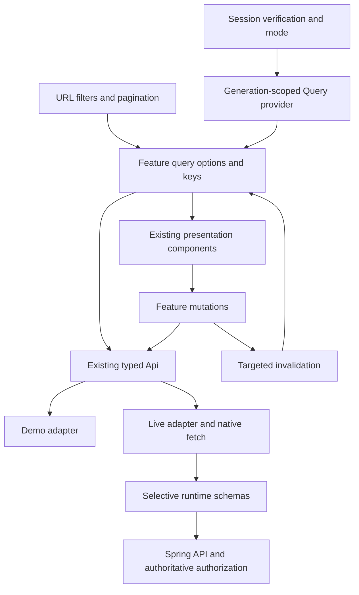
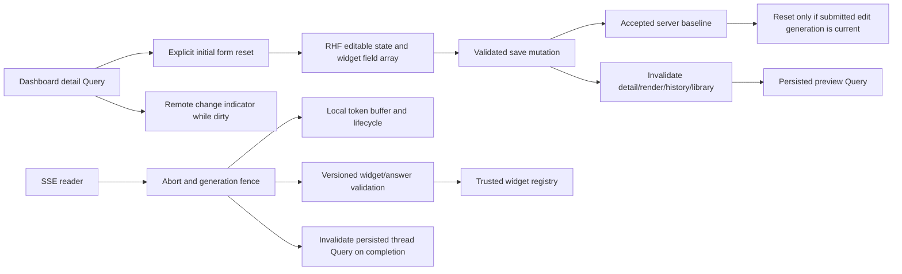

# Frontend target architecture — proposal for review

Status: **proposed**, grounded in [audit](frontend-audit.md) at `f6140b8`.
This is the architectural review artifact; it does not indicate implementation approval.

## Intent and invariants

Reduce custom lifecycle mechanisms and duplicated async state while preserving Spring API
compatibility, backend-authoritative permissions, demo mode, missing-data semantics,
correlation/provenance and the existing visual identity. Keep local forms, transient UI and
streaming tokens local. Success is fewer independent mechanisms, regression evidence and
measured request/performance behavior, not dependency count or minimal line count.

## Approaches considered

1. **Recommended: transport/identity foundation, then feature-by-feature Query adoption.**
   Retains Api and existing components, permits per-concern rollback, and makes isolation
   testable before caches spread. Adds Query and selective schema/form libraries only when used.
2. Extend useApiData with cache/retry/invalidation/abort support. Avoids a dependency initially,
   but creates another maintained query framework and still leaves many ownership problems.
3. Replace Api with a generated client and migrate all screens together. Generation may become
   useful after an OpenAPI export exists; today it increases scope and couples unrelated UI
   migrations. A broad rewrite would make compatibility and rollback harder to verify.

## Module ownership

| Module | Owns | Depends on |
| --- | --- | --- |
| `lib/api` | transport, typed errors, demo/live adapters, optional read request signal | fetch, boundary schemas |
| `lib/query` (new) | one browser QueryClient/provider, scope lifecycle, conservative defaults | React Query, identity/mode lifecycle |
| Feature `queries.ts` / `mutations.ts` | stable key factories/options, affected-resource invalidation | Api, Query; avoid generic hook wrappers |
| Auth/current-user provider | session verification/status/generation, transition cache clearing | auth transport, QueryClient cancellation/clear |
| Dashboard editor subcomponents | editable document, widget field array, preview, history, action UI | RHF, resolver, dashboard schemas, feature queries |
| Data explorer subcomponents | URL selection/filters/page, result views and details | Next router, feature queries, DataTable |
| Chat controller | AbortController + generation, token buffer, stream lifecycle | native fetch, answer/widget schemas |
| Widget schemas/registry | version-aware validation and trusted rendering dispatch | Zod; existing UI/charts |
| Existing shared presentation | form controls, states, dialogs, tables, formatting, tokens | existing Tailwind/Radix/Lucide/Sonner |

Keep feature files near current component directories; do not relocate the application tree
or introduce a broad global state manager. Move widget contract types to a neutral boundary
module only as needed to stop API types importing presentation directories.

## Identity and cache isolation

Create one QueryClient for a mounted browser provider; never a module singleton shared by SSR
requests. There is no persisted cache. Resolve demo/live hydration before enabling scoped
reads. Query key prefix is `['scope', mode, sessionGeneration]`; features append normalized
parameters, for example `['dashboards','detail',id]` or `['data','raw',filters,page,size]`.
Keys include every backend-effective parameter, not draft text that has not been applied.

Because current `/api/me` has no user ID, use the brief's explicit-clear option: on logout,
login, signup-login, mode change, unverified session, or identity revalidation transition,
cancel in-flight reads, advance generation, clear user-specific Query/Mutation state and
close user-specific editing/stream contexts. Gate live reads while identity is unverified.
Clear the user field on unauthenticated/error outcomes; do not treat parse failures as sign-out.
Abort signals plus old generation keys prevent late responses from becoming current data.

Revalidate session before re-enabling live reads after focus; coalesce concurrent profile
checks. Until a stable server subject is available, even matching profile fields do not prove
the same user: clear the prior query scope on each identity revalidation. This is conservative
and reduces cache reuse across focus transitions. Cache clearing must not silently reset a
dirty form: suspend live editing during verification and provide an explicit unsaved-change
resolution before closing its local context. Keep cancelled query generations distinct from
form initialization; a cache refetch alone never reinitializes an edited document.
A future coordinated subject identifier would permit less disruptive comparison. The first
read-only migration can use explicit clearing; editor adoption must resolve this identity/
dirty-state interaction in its spec before implementation.
Never key by displayName or role. Preserve explicit Api injection in tests with isolated
providers. Backend denies remain authoritative regardless of cache state.

## Query and mutation policy

- Default business read staleTime: 30 seconds; connector/recompute status: 10 seconds;
  descriptor/template metadata: 5 minutes. Initial gcTime: 5 minutes, no disk persistence.
  These are proposed freshness choices to verify, not measured optimal values.
- At most one automatic read retry for transient network/502/503/504 failures. No retry for
  abort, authentication, permissions, validation/integrity errors, or other 4xx failures.
  Respect Retry-After where supplied; bound delay. Disable ungated background focus refetch;
  session revalidation owns focus sequencing. Recompute polling runs only while active.
- Every mutation has `retry: false`, including PUT pin toggle. Disable duplicate submissions.
  Prefer pessimistic changes first; uncertain write outcomes must not be blindly repeated.
- Use Query directly, with feature query options/key factories rather than a new useApiData
  wrapper. Extend read Api signatures with an optional `{ signal?: AbortSignal }` argument,
  forwarded by live helpers to fetch; demo supports cancellation or at least guarded publication.
- First-load errors are persistent inline views with retry and correlation; background errors
  retain prior data only within the same scope/resource and show stale/refresh-failed status.
  Distinguish pending, empty, refreshing, stale and permission denial.
- Pagination may retain previous data only within the same entity and applied filters, marked
  as previous/loading; disable row actions until the requested page is current. Never retain
  previous-user, mode, entity or filter results as if they matched the current request.

### Invalidation ownership

| Successful action | Invalidate/update |
| --- | --- |
| pin | returned detail, dashboard library |
| create/template/draft save | library + returned detail; open only after successful create |
| save/restore | detail, render, revisions, library |
| delete dashboard | remove detail/render/revisions/sharing; invalidate library |
| rule save/delete | rules, audit, recompute; affected reconciliation/resolved/business reads |
| override | record, exceptions, audit, resolved rows, provenance, bootstrap/summary |
| connector run/upload | connector/status + relevant source-domain reads, pipeline counts and bootstrap; completion semantics determine refresh timing |
| thread rename/delete | list, affected thread; cancel stream before deleting its active thread |
| completed chat | thread/list history metadata; token buffer remains local |

Do not populate summary from bootstrap unless backend fixtures prove identical authorization,
shape and freshness semantics. Avoid parallel reload chains that unmount the entire editor.

## Transport and failure model

Keep fetch. Build headers via `new Headers(init.headers)`, preserve Accept overrides and CSRF,
same-origin credentials, and safe URL parameter/path encoding. For every HTTP failure retain
status, code, safe message, header/envelope correlation, field errors and cause. Network
failures have no HTTP status; abort is cancellation, not a connection failure. Distinguish
network, HTTP/auth/permission, server validation/conflict, malformed response, schema integrity
and unexpected programmer exception. Do not expose raw unknown exception messages to users.

Explicitly support 204 and successful empty bodies for methods declared `Promise<void>`;
empty bodies at JSON-required endpoints are integrity failures. Redirected non-JSON/login
responses are diagnosable protocol/auth outcomes, never a successful typed object. Validate
error envelopes before trusting metadata, with X-Correlation-ID header fallback. Runtime
validation is optional per transport call, initially auth, dashboard documents and widget
render/AI documents. Never turn invalid data into a valid empty result.

One reporting owner handles each caught unexpected failure: QueryCache/MutationCache for
cached operations, stream controller for streaming. UI owns inline/toast feedback only.
Expected abort/validation/permission failures are not exception reports. Preserve existing
React boundaries for render exceptions; do not report the same error again in feature catches.
Attach safe feature/status/code/correlation tags, not document contents or filter text.

## Editing and streaming data flow

Dashboard form: use RHF with Zod/resolver and useFieldArray. Infer validated boundary types
from schemas where possible. Preserve wire documents and widget IDs; keep RHF row IDs separate.
Define title/range/layout/query validation from backend accepted inputs and fixtures. Initialize
once per dashboard/scope, not on every refetch. Dirty forms receive a remote-change notice.
Disable fields during save initially, or retain newer edit generations without resetting them.
Close, route change and beforeunload protect unsaved changes; restore/delete require confirmation.
Preview remains the backend-rendered **persisted** document, labeled accordingly; no invented
unsaved-preview endpoint. Preserve current grid and keyboard resize/reorder controls.

Streaming lifecycle: idle → connecting → streaming → completed/failed/cancelled. Abort and
advance generation on reset, replacement, scope change and unmount; every callback/finally
checks generation. Clean up reader in finally; handle LF/CRLF split frames and decoder tail.
Do not retry a chat turn automatically. Surface typed diagnostics for malformed events rather
than silently dropping an authoritative answer. Invalidate persisted history only for the
correct thread/scope. Never put per-token state into Query.

## Explorer and presentation

Separate raw/canonical/resolved components; shared result/pager and raw/detail/provenance
patterns retain existing UI. Native Next search params/router are the initial choice, with
validated URL defaults and browser back/forward synchronization. Use explicit Apply for raw
free-text/ISO filters; page resets atomically when applied filters or selection change.
Server pagination is supported. Current-page sorting must be labeled or disabled; only add
server sorting when the backend accepts it. Descriptor metadata stays separate from row samples.
Show absent values distinctly from `0` and `""`; do not promise rich schema information that
the descriptor endpoint lacks. Row inspection actions are keyboard-accessible.

Keep Tailwind tokens, Radix/shadcn, Lucide, Recharts, React Flow, Sonner and role-sensitive
presentation. Extract shared patterns only from demonstrated repetition. Use existing financial,
numeric, percentage and temporal formatters. Evaluate lazy-loading graph/editor chunks using
the production bundle/browser baseline; no competing framework or layout dependency.

## Acceptance and unresolved decisions

Required regression evidence: cache deduplication/isolation, stale read cancellation,
transport empty/malformed/status/header cases, permission placeholders, demo transitions,
action rejection handling, dirty/refetch/save races, URL back/forward/page reset, missing-value
rendering, streaming reset/replacement/unmount and schema-version fixtures. Preserve and run
all existing tests. MSW verifies network boundaries; Playwright verifies high-value workflows.
CI runs unit/integration tests and a reproducible browser subset.

Open for review: conservative profile-revalidation cache clearing policy; exact freshness
values; how much of connector/recompute completion the existing endpoints expose. Live
authenticated fixtures and measurements are required before claiming live compatibility or
performance gains. Full-dataset sorting, typed explorer schemas and stable subject export
require explicitly coordinated backend work if pursued.
